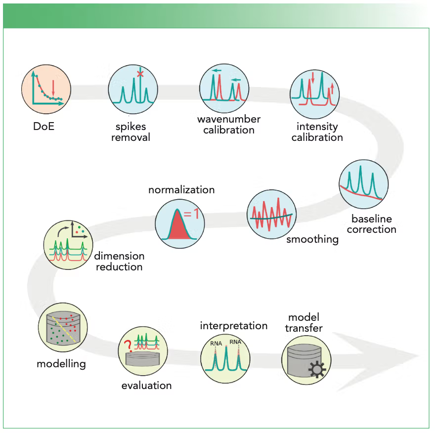

# References

## 1. Key Steps in the Workflow to Analyze Raman Spectra
- **Link:** [workflow-to-analyze-raman-spectra](https://www.spectroscopyonline.com/view/key-steps-in-the-workflow-to-analyze-raman-spectra)
- **Summary:** *Related to workflow for analyze raman spectra*
- 

---

## 2. RAMANMETRIX: a delightful way to analyze Raman spectra 
- **Link:** [RAMANMETRIX](https://arxiv.org/pdf/2201.07586)
- **Summary:** *Existed research/development on Raman spectrum analysis GUI/tools*
- 

---

## 3. RamanSPy
- **Link:** [ramanspy](https://ramanspy.readthedocs.io/)
- **Summary:** *RamanSPy is an open-source Python library for Raman spectroscopic research and analysis, which accelerates day-to-day analyses, research applications, as well as the development and validation of new methods and algorithms.*
- 

---