## CASE 1
### hirsh
`Tamura/引き継ぎ/ヒルシュ/データ/merged_data_raw/Case1/hirsch/hirsch.csv`
#### `RAW`

#### `Analysis`
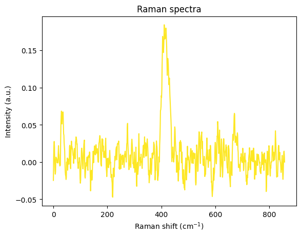

#### `PCA + k-means`
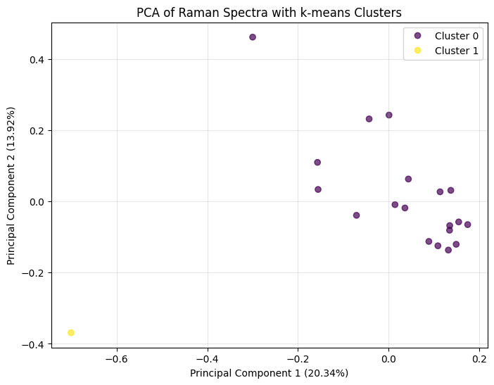
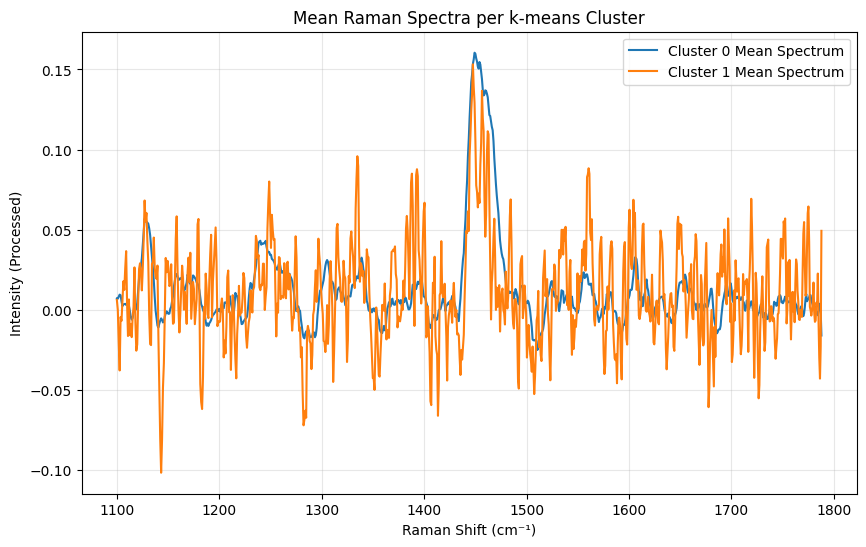

### normal
`Tamura/引き継ぎ/ヒルシュ/データ/merged_data_raw/Case1/normal/normal.csv`
#### `RAW`
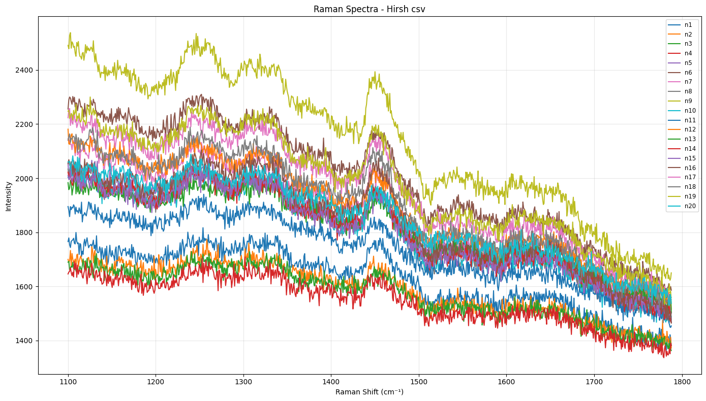
#### `Analysis`
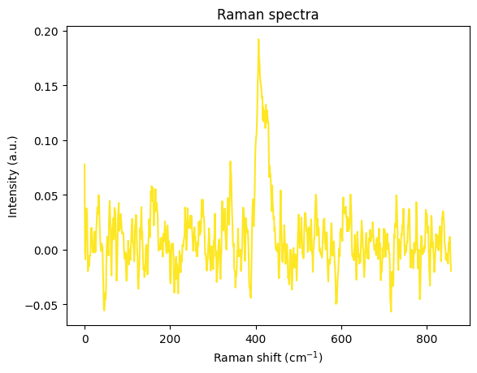
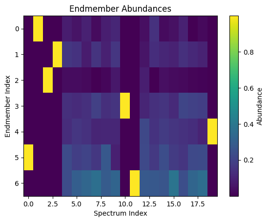
#### `PCA + k-means`
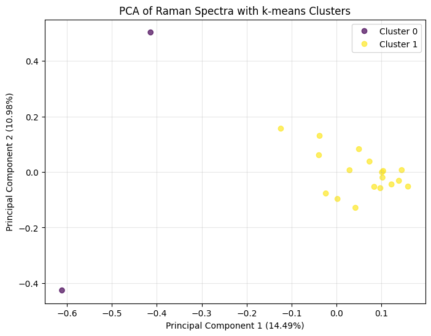
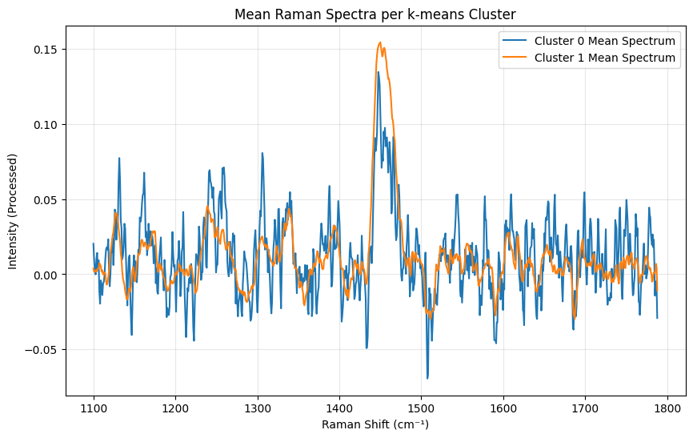

### Case 2 hirsh
`Tamura/引き継ぎ/ヒルシュ/データ/merged_data_raw/Case2/hirsch/hirsch.csv`
#### `RAW`
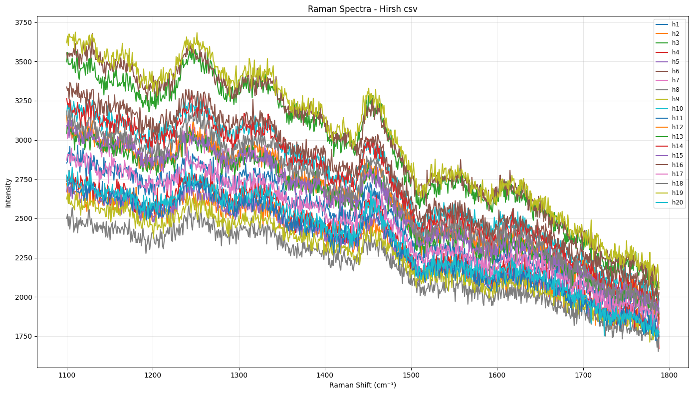
#### `Analysis`
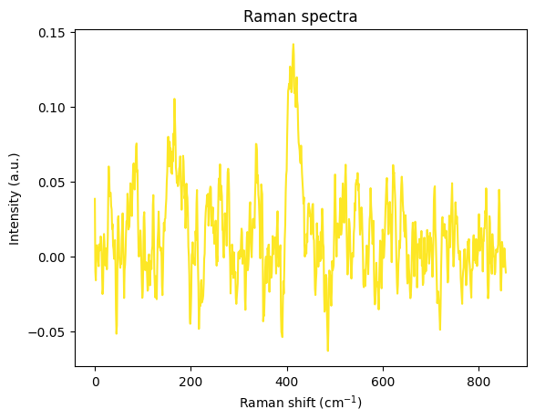
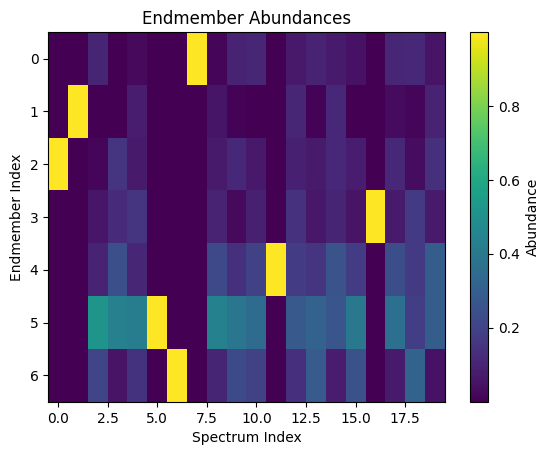
#### `PCA + k-means`
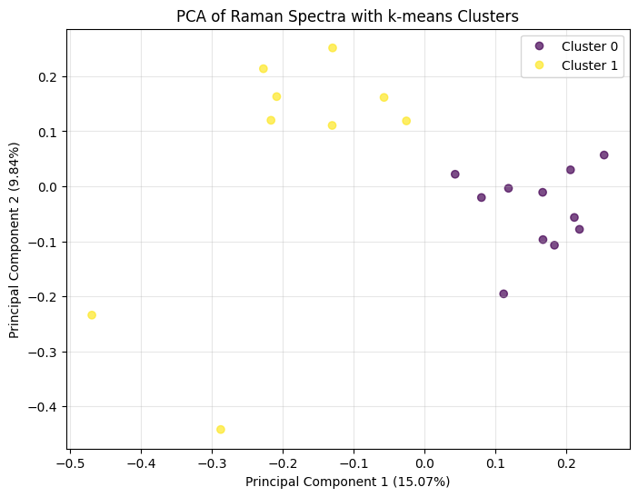
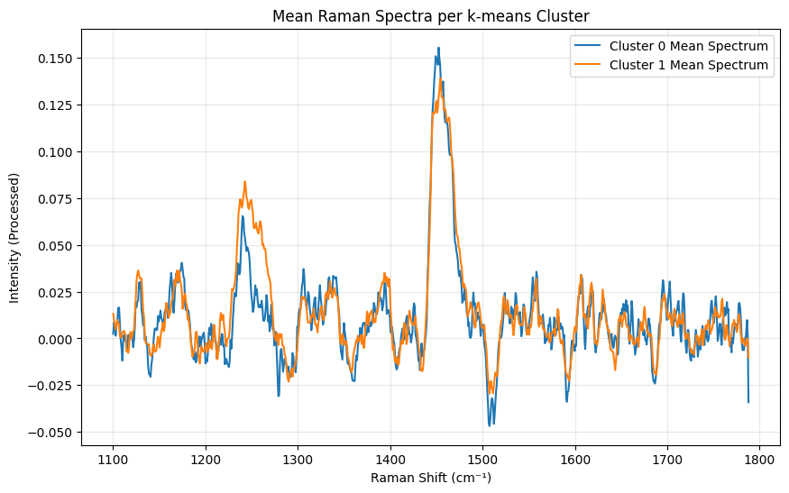

### Case 3 hirsh
`Tamura/引き継ぎ/ヒルシュ/データ/merged_data_raw/Case3/hirsch/hirsch.csv`
#### `RAW`
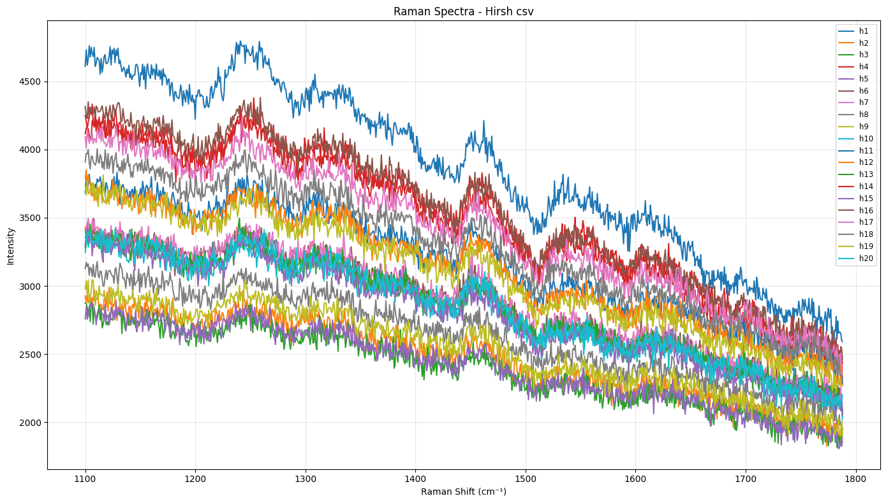
#### `Analysis`
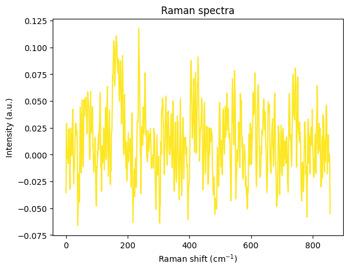
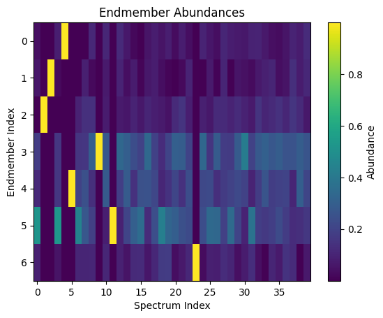
#### `PCA + k-means`

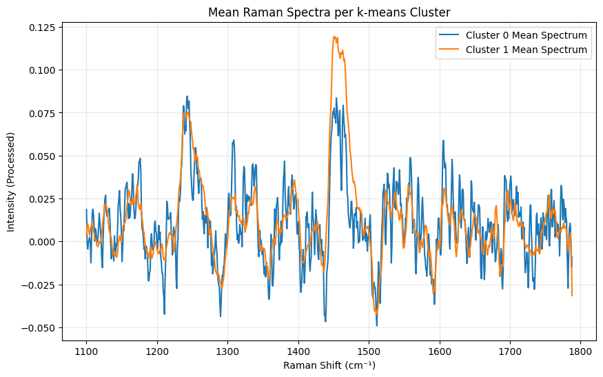

